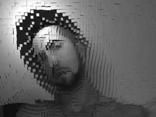

# PinPortrait: 3D Webcam Pixelation Experiment

PinPortrait is an interactive web experiment that transforms your webcam feed into a dynamic 3D pixel art portrait. This project explores the intersection of computer vision, 3D graphics, and interactive design, offering a unique and engaging user experience.

  
  

## Features

- Real-time webcam input processing
- 3D representation of pixelated video feed
- Interactive camera controls for exploring the 3D space
- Customizable pixel size and color mapping

## How It Works

PinPortrait uses the following technologies and techniques:

1. **Webcam Input**: Captures live video feed from the user's webcam.
2. **Canvas Pixelation**: Processes the video feed and calculates average color values for each pixel block.
3. **Three.js 3D Rendering**: Creates a 3D scene with cubes representing each pixel.
4. **Dynamic Updates**: Continuously updates cube colors and heights based on the processed video data.
5. **Interactive Controls**: Allows users to orbit, zoom, and pan around the 3D scene.

## Customization

PinPortrait is designed to be easily customizable. Here are some ways you can modify the project:

- Adjust the `size` variable in `sketch.js` to change the pixel/cube size
- Modify the color mapping in the `setupColors()` function for different visual effects
- Experiment with different 3D geometries by replacing the cube mesh in `setupCubes()`
- Add post-processing effects using Three.js post-processing library
- Implement additional interactivity, such as click events on individual cubes

## Getting Started

To run PinPortrait locally:

1. Clone this repository
2. Open `index.html` in a modern web browser
3. Allow access to your webcam when prompted

## Performance Considerations

The performance of PinPortrait depends on the capabilities of the user's device. For optimal perfo